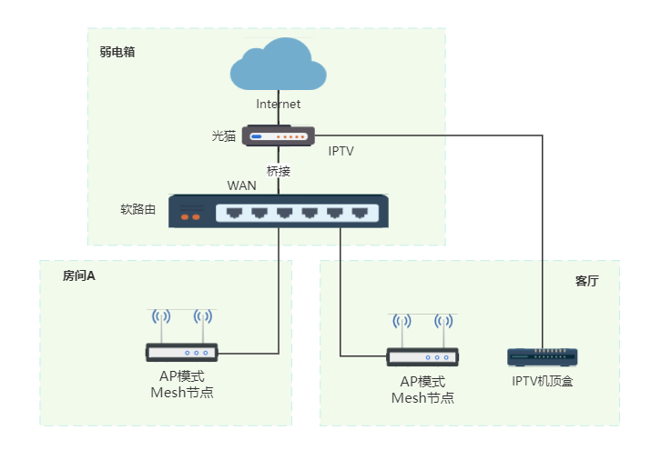

# 无线组网-路由器 wifi6

路由器品牌：高端的御三家『Netgear网件/Linksys领势/Asus华硕』和其他

Wifi5-AC路由器 | Wifi6-AX路由器

## Wifi6 技术
- 支持1024的QAM，可以带来更高的速度，这个AC86U就支持；
- MU-MIMO多用户多进多出，解锁上行，原Wi-Fi 5第二版仅支持下行（且最大4*4）；
- OFDMA技术，这个技术是跨时代的，类似于2G时代出现的CDMA技术；
- 波束成形技术Beamforming，这个Wi-Fi5时代华硕等就有。

重要的是波束成形和OFDMA技术的结合：

+ 可以覆盖面积更大，穿透能力更强；
+ 且有效的提升了带宽和降低了延迟。

### 频段
160MHz（实际上可用率受限）。
我国的5.8G频段可用信道太少，所以正常情况下三频路由器的5G-2频段开不了160MHz
USB 3.0会干扰Wi-Fi 5GHz频段的使用

Wifi6E 四个频段：2.4G+5G1+5G2+6G

### 连接模式
华硕支持：
无线路由器模式/AiMesh 路由器模式(默认)
无线接入点(AP)模式/AiMesh 路由器(AP模式) -- 选择此模式
中继模式
无线桥接(Media Bridge)
AiMesh 节点

领势支持：
手动(默认) 无线路由器模式
    支持 mesh 组网 (无线 + 有线)
桥接模式 即 AP模式 -- 选择此模式
    支持 mesh 组网

MESH组网的特点：
    无线名称统一
    网络管理统一
    增加节点方便
    支持有线，无线，混合等组网方式
    良好的漫游体验

Wi-Fi联盟 推出 Wi-Fi EasyMesh标准认证，通过认证的路由设备可以实现跨平台的Mesh通信部署。
EasyMesh支持有线和无线数据回程，回程可以共享或专用。EasyMesh不是靠专门的硬件搭配，而是借助软件就可实现。

华硕AiMesh2.0 组网更方便，节点跟主路由器夸两个交换机都没问题。
领势或者网件方案，这个延迟会更低，体验会更好。
华硕、领势都支持和旧的wifi5机型组mesh，环保不浪费。网件组mesh不好用。
领势支持easymesh 

新款AX系列的Wi-Fi6路由器均支持Mesh组网。

## 组网
- 企业无线网络 AC+AP方案 
    追求稳定和性能
    缺点：AC 路由器 代表与 wifi 6 绝缘

- 个人家庭 主路由+子路由 有线MESH组网(有线回程) -- 普通用户最理想的组网方式
    网络最稳定
    使用有线回程Mesh，网络调度不占用额外无线频宽

有线组网之前，需要先进行无线MESH组网，组网完成后，再进行网线的连接。不要开始组网的时候就连接网线。
主路由与子路由直接网线相连

- 进阶 软路由+AP模式有线MESH组网 -- (推荐)

软路由作为主路由。其他路由器，通过AP模式进行有线MESH组网。
AP模式下：
    所有的路由器仅提供无线功能，其他路由器固件的高端功能，比如防火墙，端口映射等都无法使用。
    只进行无线覆盖，不进行拨号上网，数据转发功能，对路由器的自身功能损失比较大。
    有时候路由器自身的APP功能也会受到影响。
ap模式下，路由器没有WAN口，随便插。

方法1 主MESH节点与子MESH节点先进行无线MESH组网，组网成功后：
    关闭主路由器的DHCP。
    再将主路由器，接入软路由，并改成AP模式。
    mesh节点路由，通过有线接入软路由器。
方法2 主MESH节点接入软路由，并改成AP模式。
    子mesh节点接入软路由，并改成AP模式。
    主mesh节点上搜索mesh节点，按子mesh节点后面的mesh按钮进行配对。

测试mesh:
拿着笔记本一直ping网关，然后移动笔记本在各个房间走动，等待节点自动切换。

## wifi6 路由器对比
- 红米 AX6000
联发科 MT7986A CPU 4x2.0GHz
5G 芯片 MT7976AN  2.4G 芯片 MT7976GN
5G 功放 RTC66568  20dBm  2.4G 功放 RTC66266 20.5dBm
RAM 512MB ROM 128MB

- ASUS AX86U (861+4804)
博通 BCM4908 CPU
5G 芯片 BCM43684  2.4G 芯片 BCM6710
5G 功放 FEM  20dBm  2.4G 功放 FEM
RAM 1024MB ROM 256MB
1(2.5G)+5个千兆口
4x4 mu-mimo

AX82U/AX3000/AX58U AX5400 (574+4804)
博通 BCM6750 CPU
4x4 160MHz MU-MIMO + OFDMA + 1024QAM
DFS 全开放 15个DFS信道(大陆开放4个)

- LINKSYS E9450 AX5400 (5G 4804Mbps 2.4G 574Mbps) -- 苹果专用
博通 BCM6750 CPU (3x1.5GHz)
5G 芯片 BCM43684  2.4G 芯片 集成
5G 功放 FEM  2.4G 功放 FEM 
RAM 512MB ROM 256MB
40+ 设备
5G 4x4 mu-mimo
2.4G 2x2 mu-mimo
1 WAN 4 LAN 全千兆
4x4 160MHz MU-MIMO + OFDMA + 1024QAM
完整 MU-MIMO 技术 4x4 天线技术
全新 Eash Mesh 多种回程

linksys e9450 缺点:
1. 不支持手机APP, 只能通过网页设置。
2. mesh 模式(网状网络) 下，只能用 2.4G和5G 双频合一模式。
   在 non mesh system 模式 (一般设置-Mesh设置 选择节点类型：非网络系统) 下才可以把 2.4G 和 5G 分开。
3. 仅支持无线回程，不支持有线回程。

优点：
1. 支持 easymesh, 可以实现扩平台 mesh 组网。
2. 160MHz wifi6
3. 颜值在线，有科技感。

主mesh节点设置：
后台地址 192.168.79.1 (不是 192.168.1.1 / 192.168.0.1)
询问 添加的是什么节点。 第一个节点 选 父节点。 后面添加的 节点 选 子节点 。
一般设定-无线网络 桥接模式
进阶设定-LAN 
    修改 ip地址 192.168.1.xxx

EasyMesh 任意组网 - 添加 子节点：
1. 初次设置时组网：可以添加子节点模式。
    设置 新的 admin 密码
    设置为 子节点 
    更改 LAN ip
    重启 子节点 通过 网线 接入 局域网。
    主节点 的 mesh 设置 自动添加了该子节点 但是分配的 ip 里设置的 ip不一样。
        自己设置的 ip 被主节点 分配成了 新的ip。
            (虽然登录子节点新ip 还能看到 自己设置的 Lan ip, 但此 ip 全网不可见不可访问。)
        自己设置 的 admin 密码 也被改为了 同 主节点一样。
2. 通过网页管理见面设置，在 mesh设置 中选择添加 子节点 去操作。     
3. 通过 WPS 模式 (不需要修改网段 可以采用此方法比较方便)：
    父 mesh 节点以设置完，子 mesh 节点处于出厂模式。
    长按 父 mesh 节点的 WPS, 直到 mesh 灯闪烁，再按 子节点的 wps 键，直到 mesh 灯闪烁，自动组网。
        此方式虽然可以连上，但父节点 已经是 192.168.1 网段，子节点的 ip 依然是 192.168.79.1
        过段时间可以看到子节点的 192.168.1 网段ip ，进子节点的ip 看到 LAN 的ip 依然是 79.1 进行修改 ip
    长按 reset 恢复出厂设置

迁移方式：
1. 登录旧路由器管理后台，将 ssid 修改为别的
2. 设置 e9450 的 ssid 为旧路由器的 ssid. 

设置为美国发射功率最大。

## wifi 5 路由器
- 华硕 RT-AC86U AC2900Mbps(2166Mbps[720Mbps*3] 5G,750Mbps[250Mbps*3] 2.4G)  
802.11ac Wave 2 Wifi 
多用户多进多出MU-MIMO  
博通1.8G双核512M内存256M闪存 
千兆网口 * 5
                                                                                  
- 网件 R7000P AC2300Mbps(1625Mbps[540Mbps*3] 5G,600Mbps[200Mbps*3] 2.4G) 
802.11ac Wave 2 Wifi 
多用户多进多出MU-MIMO 
博通1G双核256M内存128M闪存 
千兆网口 * 5