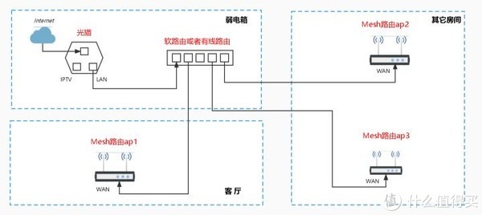

# 无线组网-路由器 wifi6

路由器品牌：高端的御三家[网件/领势/华硕]和其他

Wifi5-AC路由器
Wifi6-AX路由器

## Wifi6 技术
- 支持1024的QAM，可以带来更高的速度，这个AC86U就支持；
- MU-MIMO多用户多进多出，解锁上行，原Wi-Fi 5第二版仅支持下行（且最大4*4）；
- OFDMA技术，这个技术是跨时代的，类似于2G时代出现的CDMA技术；
- 波束成形技术Beamforming，这个Wi-Fi5时代华硕等就有。

重要的是波束成形和OFDMA技术的结合：
- 可以覆盖面积更大，穿透能力更强；
- 且有效的提升了带宽和降低了延迟。

频段：
160MHz（实际上可用率不高），这些都不是重要的。
我国的5.8G频段可用信道太少，所以正常情况下三频路由器的5G-2频段开不了160MHz
USB 3.0会干扰Wi-Fi 5GHz频段的使用

Wifi6E 四个频段：2.4G+5G1+5G2+6G

连接模式：
AP模式(MESH)   同一个网络，wifi名称不会变  -- 最优解
无线中继        同一个网络，wifi名称会变化
桥接            新的网段

MESH组网的特点：
    无线名称统一
    网络管理统一
    增加节点方便
    支持有线，无线，混合等组网方式
    良好的漫游体验

Wi-Fi联盟 推出 Wi-Fi EasyMesh标准认证，通过认证的路由设备可以实现跨平台的Mesh通信部署。
EasyMesh支持有线和无线数据回程，回程可以共享或专用。EasyMesh不是靠专门的硬件搭配，而是借助软件就可实现。

华硕AiMesh2.0 组网更方便，节点跟主路由器夸两个交换机都没问题。
领势或者网件方案，这个延迟会更低，体验会更好。
华硕、领势都支持和旧的wifi5机型组mesh，环保不浪费。网件组mesh不好用。
领势支持easymesh 

新款AX系列的Wi-Fi6路由器均支持Mesh组网。

## 组网
- 企业无线网络 AC+AP方案 
    追求稳定和性能
    缺点：AC 路由器 代表与 wifi 6 绝缘

- 个人家庭 主路由+子路由 有线MESH组网(有线回程) -- 普通用户最理想的组网方式
    网络最稳定
    使用有线回程Mesh，网络调度不占用额外无线频宽

有线组网之前，需要先进行无线MESH组网，组网完成后，再进行网线的连接。不要开始组网的时候就连接网线。
主路由与子路由直接网线相连

- 进阶 软路由+AP模式有线MESH组网 -- (推荐)

软路由作为主路由。其他路由器，通过AP模式进行有线MESH组网。
AP模式下：
    所有的路由器仅提供无线功能，其他路由器固件的高端功能，比如防火墙，端口映射等都无法使用。
    只进行无线覆盖，不进行拨号上网，数据转发功能，对路由器的自身功能损失比较大。
    有时候路由器自身的APP功能也会受到影响。
ap模式下，路由器没有WAN口，随便插。

方法1 主MESH节点与子MESH节点先进行无线MESH组网，组网成功后：
    关闭主路由器的DHCP。
    再将主路由器，接入软路由，并改成AP模式。
    mesh节点路由，通过有线接入软路由器。
方法2 主MESH节点接入软路由，并改成AP模式。
    子mesh节点接入软路由，并改成AP模式。
    主mesh节点上搜索mesh节点，按子mesh节点后面的mesh按钮进行配对。

测试mesh:
拿着笔记本一直ping网关，然后移动笔记本在各个房间走动，等待节点自动切换。

## wifi6 路由器对比
- 红米 AX6000
联发科 MT7986A CPU 4x2.0GHz
5G 芯片 MT7976AN  2.4G 芯片 MT7976GN
5G 功放 RTC66568  20dBm  2.4G 功放 RTC66266 20.5dBm
RAM 512MB ROM 128MB

- ASUS AX86U (861+4804)
博通 BCM4908 CPU
5G 芯片 BCM43684  2.4G 芯片 BCM6710
5G 功放 FEM  20dBm  2.4G 功放 FEM
RAM 1024MB ROM 256MB
1(2.5G)+5个千兆口
4x4 mu-mimo

AX82U/AX3000/AX58U BCM6750 (574+4804)

- LINKSYS E9450 AX5400 (5G 4804Mbps 2.4G 574Mbps)
博通 BCM6750 CPU 3x1.5GHz
5G 芯片 BCM43684  2.4G 芯片 集成
5G 功放 FEM  2.4G 功放 FEM 
RAM 512MB ROM 256MB
40+ 设备
5G 4x4 mu-mimo, 2.4G 2x2 mu-mimo
1 WAN 4 LAN 全千兆
全新 Eash Mesh
160MHz

## wifi 5 路由器
- 华硕 RT-AC86U AC2900Mbps(2166Mbps[720Mbps*3] 5G,750Mbps[250Mbps*3] 2.4G)  
802.11ac Wave 2 Wifi 
多用户多进多出MU-MIMO  
博通1.8G双核512M内存256M闪存 
千兆网口 * 5
                                                                                  
- 网件 R7000P AC2300Mbps(1625Mbps[540Mbps*3] 5G,600Mbps[200Mbps*3] 2.4G) 
802.11ac Wave 2 Wifi 
多用户多进多出MU-MIMO 
博通1G双核256M内存128M闪存 
千兆网口 * 5